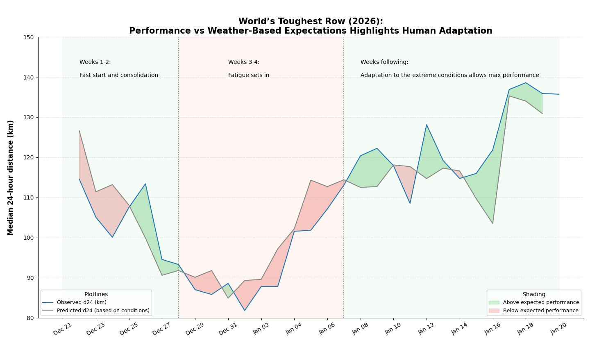

# worlds-toughest-row-weather-analysis
Estimating expected performance from weather data to reveal adaptation in extreme endurance events.

# 🌊 Weather-Adjusted Performance Modeling

Estimating expected rowing performance from environmental conditions to reveal human adaptation under extreme conditions.

---

## 🧠 Problem
Observed performance is strongly influenced by weather.  
This project separates:
- what is explained by conditions  
- from what remains (adaptation, fatigue, strategy)

---

## ⚙️ Approach
- Reconstruct boat position along the route (KML + distance)
- Align local weather in time and space
- Engineer features (wind/current vectors, wave stats)
- Fit an interpretable OLS model
- Compare **observed vs expected performance**

---

## 📈 Result
Residuals (observed − expected) highlight:
- early overperformance  
- mid-race fatigue  
- later-stage adaptation  

---

## 🖼️ Visualization

---

## 🧩 Takeaway
Performance is not just output — it emerges from interacting systems.  
Modeling external constraints helps reveal what the data alone hides
